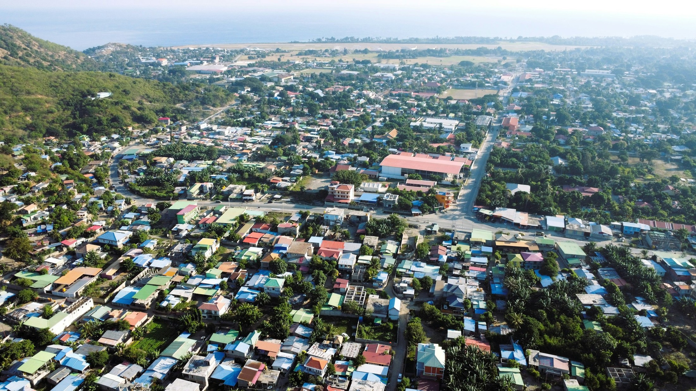

# 🇹🇱 Timor-Leste Tourism Website

A modern, responsive tourism website showcasing the beauty and culture of Timor-Leste. Built with Next.js 16, featuring stunning visuals, interactive maps, and smooth animations.



## ✨ Features

- 🎨 **Modern UI/UX** - Beautiful design using Timor-Leste flag colors (Red, Yellow, Black, White)
- 📱 **Fully Responsive** - Optimized for mobile, tablet, and desktop
- 🗺️ **Interactive Map** - Leaflet-powered map showing all tourist destinations
- 🖼️ **Real Images** - Stunning photography of Timor-Leste's landscapes and attractions
- ⚡ **Smooth Animations** - Powered by Framer Motion
- 🚀 **Optimized Performance** - Built with Next.js 16 and modern best practices
- 🎯 **SEO Friendly** - Proper meta tags and semantic HTML

## 📋 Sections

1. **Hero** - Eye-catching landing section with call-to-action
2. **About Timor-Leste** - Statistics and information about the country
3. **Destinations** - 6 featured tourist locations:
   - Atauro Island
   - Cristo Rei Beach
   - Jaco Island
   - Mount Ramelau
   - Tais Market
   - Tibar Bay
4. **Interactive Map** - Explore all locations on an interactive map
5. **Culture & Heritage** - Traditional arts, music, and customs
6. **Activities** - 8 adventure activities:
   - Scuba Diving
   - Mountain Trekking
   - Snorkeling
   - Coffee Tours
   - Photography Tours
   - Beach Activities
   - Cultural Tours
   - Adventure Sports
7. **Footer** - Contact information, links, and newsletter signup

## 🛠️ Tech Stack

- **Framework**: [Next.js 16](https://nextjs.org/)
- **Language**: [TypeScript](https://www.typescriptlang.org/)
- **Styling**: [Tailwind CSS 3](https://tailwindcss.com/)
- **Animations**: [Framer Motion](https://www.framer.com/motion/)
- **Maps**: [React Leaflet](https://react-leaflet.js.org/)
- **Icons**: [React Icons](https://react-icons.github.io/react-icons/)
- **Fonts**: [Geist](https://vercel.com/font)

## 📦 Installation

### Prerequisites

- Node.js 18+ installed
- npm, yarn, pnpm, or bun package manager

### Step 1: Clone the Repository

```bash
git clone https://github.com/yourusername/timor_leste_tourism.git
cd timor_leste_tourism
```

### Step 2: Install Dependencies

```bash
npm install
# or
yarn install
# or
pnpm install
```

### Step 3: Run Development Server

```bash
npm run dev
# or
yarn dev
# or
pnpm dev
```

Open [http://localhost:3000](http://localhost:3000) in your browser to see the website.

## 🚀 Deployment on Vercel

Vercel is the easiest way to deploy your Next.js application. Follow these steps:

### Method 1: Deploy via Vercel Dashboard (Recommended)

1. **Create a Vercel Account**
   - Go to [vercel.com](https://vercel.com)
   - Sign up with GitHub, GitLab, or Bitbucket

2. **Import Your Repository**
   - Click "Add New..." → "Project"
   - Import your Git repository
   - Vercel will automatically detect it's a Next.js project

3. **Configure Project Settings**
   - **Framework Preset**: Next.js (auto-detected)
   - **Build Command**: `npm run build` (default)
   - **Output Directory**: `.next` (default)
   - **Install Command**: `npm install` (default)

4. **Environment Variables** (if needed)
   - Add any environment variables in the dashboard
   - None required for this project currently

5. **Deploy**
   - Click "Deploy"
   - Wait 1-2 minutes for deployment to complete
   - Your site will be live at `https://your-project.vercel.app`

### Method 2: Deploy via Vercel CLI

1. **Install Vercel CLI**
   ```bash
   npm install -g vercel
   ```

2. **Login to Vercel**
   ```bash
   vercel login
   ```

3. **Deploy**
   ```bash
   vercel
   ```

4. **Deploy to Production**
   ```bash
   vercel --prod
   ```

### Method 3: One-Click Deploy

[](https://vercel.com/new/clone?repository-url=https://github.com/yourusername/timor_leste_tourism)

Click the button above to deploy this project to Vercel with one click!

## 🔧 Build for Production

To create an optimized production build:

```bash
npm run build
npm run start
```

This will:
- Build the application for production
- Optimize all images and assets
- Generate static pages where possible
- Create an optimized bundle

## 📁 Project Structure

```
timor_leste_tourism/
├── app/
│   ├── layout.tsx          # Root layout with metadata
│   ├── page.tsx            # Main home page
│   ├── globals.css         # Global styles and Tailwind
│   └── favicon.ico         # Favicon
├── components/
│   ├── Navigation.tsx      # Navigation bar
│   ├── Hero.tsx           # Hero section
│   ├── About.tsx          # About section
│   ├── Destinations.tsx   # Destinations section
│   ├── TourismMap.tsx     # Map wrapper component
│   ├── Map.tsx            # Interactive Leaflet map
│   ├── Culture.tsx        # Culture section
│   ├── Activities.tsx     # Activities section
│   └── Footer.tsx         # Footer component
├── public/
│   └── image/             # All destination images
│       ├── Atauro-Island.webp
│       ├── Cristo-Rei-Beach.webp
│       ├── Jaco-Island.webp
│       ├── Mount-Ramelau.jpg
│       ├── Tais-Market.jpg
│       ├── Tibar-Bay.jpg
│       ├── Beautiful-Timor-Leste-Landscape.jpeg
│       ├── Traditional-Tais-Patterns.jpg
│       ├── Scuba-Diving.jpg
│       ├── Mountain-Trekking.jpg
│       ├── Snorkeling.jpg
│       ├── Coffee-Tours.jpg
│       ├── Photography-Tours.jpg
│       ├── Beach-Activities.jpg
│       ├── Cultural-Tours.avif
│       └── Adventure-Sports.jpg
├── tailwind.config.js     # Tailwind configuration
├── postcss.config.js      # PostCSS configuration
├── next.config.ts         # Next.js configuration
├── tsconfig.json          # TypeScript configuration
└── package.json           # Dependencies and scripts
```

## 🎨 Color Palette

The website uses the official Timor-Leste flag colors:

- **Red**: `#DC241F` - Primary color
- **Yellow**: `#FFC726` - Accent color
- **Black**: `#000000` - Text and accents
- **White**: `#FFFFFF` - Backgrounds

## 🖼️ Adding New Images

1. Add your images to `public/image/` folder
2. Use the Next.js Image component:
   ```tsx
   import Image from 'next/image';

   <Image
     src="/image/your-image.jpg"
     alt="Description"
     width={800}
     height={600}
     className="object-cover"
   />
   ```

## ⚙️ Configuration

### Next.js Config (`next.config.ts`)

```typescript
const nextConfig: NextConfig = {
  images: {
    formats: ['image/avif', 'image/webp'],
    deviceSizes: [640, 750, 828, 1080, 1200, 1920, 2048, 3840],
    imageSizes: [16, 32, 48, 64, 96, 128, 256, 384],
  },
};
```

### Tailwind Config (`tailwind.config.js`)

Custom colors for Timor-Leste theme are configured in the Tailwind config.

## 🐛 Troubleshooting

### Images not loading

1. Make sure images are in `public/image/` folder
2. Clear Next.js cache: `rm -rf .next`
3. Restart dev server: `npm run dev`

### Build errors

1. Delete `node_modules` and reinstall:
   ```bash
   rm -rf node_modules
   npm install
   ```

2. Clear cache and rebuild:
   ```bash
   rm -rf .next
   npm run build
   ```

### Map not displaying

The map component uses dynamic imports to avoid SSR issues with Leaflet. If you encounter issues:

1. Make sure `leaflet` CSS is imported in `layout.tsx`
2. Check browser console for errors
3. Ensure you have a stable internet connection (map tiles load from OpenStreetMap)

## 📝 Environment Variables

Currently, this project doesn't require any environment variables. If you add external APIs in the future, create a `.env.local` file:

```env
NEXT_PUBLIC_API_KEY=your_api_key_here
```

## 🤝 Contributing

Contributions are welcome! Please follow these steps:

1. Fork the repository
2. Create a feature branch: `git checkout -b feature/your-feature`
3. Commit your changes: `git commit -am 'Add new feature'`
4. Push to the branch: `git push origin feature/your-feature`
5. Submit a pull request

## 📄 License

This project is licensed under the MIT License - see the LICENSE file for details.

## 🙏 Acknowledgments

- Images courtesy of Timor-Leste tourism board
- Map data from [OpenStreetMap](https://www.openstreetmap.org/)
- Icons from [React Icons](https://react-icons.github.io/react-icons/)
- Built with [Next.js](https://nextjs.org/)

## 📞 Support

For support, email info@timor-leste-tourism.com or open an issue in the GitHub repository.

## 🔗 Links

- **Live Demo**: [https://timor-leste-tourism.vercel.app](https://timor-leste-tourism.vercel.app)
- **GitHub**: [https://github.com/yourusername/timor_leste_tourism](https://github.com/yourusername/timor_leste_tourism)
- **Vercel Dashboard**: [https://vercel.com/dashboard](https://vercel.com/dashboard)

---

**Made with ❤️ for Timor-Leste** | Powered by Next.js & Vercel
